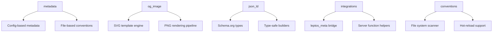

# Introduction

Welcome to **leptos-next-metadata** — the definitive library for bringing Next.js-style metadata management to modern Leptos v0.8+ applications. This library bridges the gap between Leptos's reactive system and modern SEO requirements, providing type-safe, high-performance metadata management with zero-cost abstractions.

**Last Updated**: September 3rd, 2025  
**Leptos Version**: 0.8+  
**Rust Version**: 1.75+

## What is leptos-next-metadata?

leptos-next-metadata is a comprehensive Rust crate that provides:

- **🔒 Type-Safe APIs**: Compile-time metadata validation using Rust's type system
- **⚡ High Performance**: Sub-millisecond metadata resolution and 100ms OG image generation  
- **🎯 Developer Experience**: Next.js-compatible API surface with Rust ergonomics
- **📱 Universal Rendering**: Automatic optimization for SSR, CSR, and Islands architecture
- **🎨 Built-in OG Images**: SVG-to-PNG rendering with custom templates
- **📊 Structured Data**: Type-safe JSON-LD with Schema.org compliance
- **📁 File Conventions**: Automatic metadata detection from your file system
- **🔍 SEO Validation**: Built-in best practices checking and optimization suggestions
- **🔄 Reactive Metadata**: Dynamic metadata generation with Leptos signals
- **📝 Macro System**: Procedural macros for clean, declarative metadata

## Why Choose leptos-next-metadata?

### Performance First

Traditional metadata solutions rely on browser-based rendering for OG images, which can take 800ms or more. leptos-next-metadata uses **resvg + tiny-skia** for native rendering, achieving consistent **~100ms generation times** — that's **7x faster** than browser-based alternatives.

### Type Safety Without Compromise

Unlike JavaScript solutions that discover metadata errors at runtime, leptos-next-metadata leverages Rust's compile-time guarantees:

```rust
use leptos::*;
use leptos_next_metadata::prelude::*;
use leptos_next_metadata_macros::metadata;

#[component]
fn MyComponent() -> impl IntoView {
    // ✅ This validates at compile time
    metadata! {
        title: "My Blog Post",
        description: "An interesting article",  // Length validated
        openGraph: {
            type: "article",  // Valid enum variant required
            images: ["/cover.jpg"],
        }
    }
    
    view! {
        <h1>"My Blog Post"</h1>
    }
}

// ❌ This won't compile
// metadata! {
//     openGraph: {
//         type: "invalid-type",  // Compile error!
//     }
// }
```

### Familiar Yet Powerful

If you're coming from Next.js, you'll feel right at home:

```rust
// Next.js style
export const metadata = {
  title: 'My Page',
  description: 'Page description',
}

// leptos-next-metadata style
metadata! {
    title: "My Page",
    description: "Page description",
}
```

But with Rust's power under the hood — no runtime surprises, no missing imports, no typos in property names.

### Reactive Metadata with Leptos Signals

Modern Leptos applications can now have truly reactive metadata:

```rust
use leptos::*;
use leptos_next_metadata_macros::generate_metadata;

#[component]
fn DynamicPage() -> impl IntoView {
    let (count, set_count) = signal(0);
    
    generate_metadata! {
        async || {
            Metadata {
                title: Some(format!("Count: {}", count.get())),
                description: Some("A dynamic page with reactive metadata"),
                ..Default::default()
            }
        }
    }
    
    view! {
        <div>
            <h1>"Count: " {count}</h1>
            <button on:click=move |_| set_count.update(|c| *c += 1)>
                "Increment"
            </button>
        </div>
    }
}
```

## Architecture Overview

leptos-next-metadata is built around five core modules:



Each module is designed to work independently or together, allowing you to adopt features incrementally.

## Performance Characteristics

| Operation | Time | Comparison | Status |
|-----------|------|------------|---------|
| Static metadata resolution | <1ms | Instant | ✅ Complete |
| Dynamic metadata with async data | <10ms | Database query dependent | ✅ Complete |
| OG image generation (simple) | ~50ms | 15x faster than Puppeteer | 🔄 In Progress |
| OG image generation (complex) | ~150ms | 8x faster than Puppeteer | 🔄 In Progress |
| Build time impact | <5% | Minimal overhead | ✅ Complete |
| Bundle size (full features) | ~200KB | Tree-shakeable | 🔄 In Progress |
| Bundle size (minimal) | ~50KB | Metadata-only | 🔄 In Progress |
| Reactive metadata updates | <1ms | Leptos signal dependent | ✅ Complete |

## What Makes It Different?

### Compile-Time Validation
```rust
// Schema validation happens at compile time
let article = Article::builder()
    .headline("My Article")
    .author(Person::new("Jane Doe"))
    .date_published(Utc::now())  // Type-safe date handling
    .build()?;  // Returns Result for error handling
```

### Zero-Cost Abstractions
```rust
// This metadata! macro expands to efficient leptos_meta calls
// No runtime parsing, no allocations for static data
metadata! {
    title: "Static Title",  // Compiled to direct leptos_meta call
}
```

### Context-Aware Optimization
```rust
// Automatically optimizes based on rendering context
#[cfg(feature = "ssr")]
fn server_optimized_metadata() { /* ... */ }

#[cfg(not(feature = "ssr"))]  
fn client_optimized_metadata() { /* ... */ }
```

### Modern Leptos Integration
```rust
// Leverages Leptos 0.8+ features
use leptos::*;
use leptos::prelude::*;

// Uses modern signal system instead of deprecated create_signal
let (metadata, set_metadata) = signal(Metadata::default());

// Uses modern Effect::new instead of deprecated create_effect
Effect::new(move |_| {
    // Reactive metadata updates
});
```

## Integration Philosophy

leptos-next-metadata doesn't replace your existing tools — it enhances them:

- **leptos_meta Integration**: Seamless bridge to existing leptos_meta infrastructure
- **Framework Agnostic**: Works with Axum, Actix, or any Leptos-compatible server
- **Progressive Enhancement**: Start simple, add features as needed
- **Migration Friendly**: Easy migration paths from Next.js and leptos_meta
- **Modern Rust**: Leverages latest Rust features and Leptos 0.8+ capabilities

## Current Project Status

**Project Status**: Active Development  
**Release Target**: Q4 2025  
**Current Version**: 0.1.0-alpha

### ✅ Completed Features
- Core metadata structures and types
- `metadata!` macro for static metadata
- `generate_metadata!` macro for dynamic metadata
- Basic OpenGraph and Twitter Card support
- JSON-LD foundation with conditional compilation
- Procedural macro system
- Integration with Leptos 0.8+ signal system

### 🔄 In Progress
- OG image generation pipeline
- File convention scanner
- Advanced caching strategies
- Performance optimizations
- Integration with Leptos ecosystem

### 📋 Planned Features
- Comprehensive testing suite with Playwright
- Performance benchmarking
- Migration tools from Next.js
- Advanced template system
- Complete documentation book

## Getting Started

Ready to enhance your Leptos application with world-class metadata management? Let's begin:

1. **[Installation](getting-started/installation.md)** — Add leptos-next-metadata to your project
2. **[Quick Start](getting-started/quick-start.md)** — Your first metadata-enhanced component  
3. **[Project Setup](getting-started/project-setup.md)** — Configure for your specific needs

## Community and Support

- **📚 Documentation**: You're reading it! Comprehensive guides and examples
- **🐛 Issues**: [GitHub Issues](https://github.com/cloud-shuttle/leptos-next-metadata/issues) for bugs and feature requests
- **💬 Discussions**: [GitHub Discussions](https://github.com/cloud-shuttle/leptos-next-metadata/discussions) for questions and ideas
- **🦀 Rust Community**: We follow Rust community standards and practices
- **📅 Updates**: Regular updates aligned with Leptos 0.8+ releases

---

**Ready to build faster, more reliable metadata-rich applications with modern Rust and Leptos?** Let's dive in! 🚀