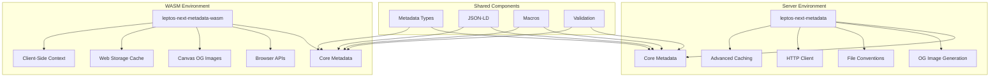

# WASM Architecture Design Document

**Date**: January 2025  
**Status**: 📐 DESIGN  
**Version**: 1.0  
**Target**: leptos-next-metadata v1.4.0

## Executive Summary

This document outlines the architectural design for WebAssembly (WASM) support in the leptos-next-metadata library. The design follows a selective WASM support strategy, enabling client-side metadata management while preserving server-side capabilities.

## Design Principles

### **1. Universal Compatibility**
- Support both server-side (SSR) and client-side (CSR/WASM) environments
- Maintain API consistency across platforms
- Enable seamless migration between rendering modes

### **2. Feature Parity with Graceful Degradation**
- Core metadata features available in all environments
- Advanced features gracefully degrade in WASM
- Clear feature boundaries and documentation

### **3. Performance Optimization**
- Minimal bundle size impact
- Efficient runtime performance
- Lazy loading of advanced features

### **4. Developer Experience**
- Unified API across platforms
- Clear error messages for unsupported features
- Comprehensive documentation and examples

## Architecture Overview

### **High-Level Architecture**



### **Module Architecture**

```
src/
├── lib.rs                    # Main library entry point
├── metadata/                 # Core metadata types (WASM compatible)
│   ├── mod.rs
│   ├── core_types.rs
│   ├── builder.rs
│   ├── merge.rs
│   └── validation/
├── json_ld/                  # JSON-LD support (WASM compatible)
│   └── mod.rs
├── macros/                   # Procedural macros (WASM compatible)
│   └── mod.rs
├── utils/                    # Utility functions (WASM compatible)
│   └── mod.rs
├── og_image/                 # Server-only OG image generation
│   ├── mod.rs
│   ├── generator.rs
│   ├── cache.rs
│   └── types.rs
├── conventions/              # Server-only file conventions
│   ├── mod.rs
│   ├── scanner.rs
│   └── types.rs
├── api/                      # Server-only API contracts
│   └── mod.rs
└── wasm/                     # WASM-specific implementations
    ├── mod.rs
    ├── metadata_context.rs
    ├── browser_apis.rs
    ├── canvas_og_image.rs
    └── cache.rs
```

## Feature Architecture

### **1. Core Metadata System**

#### **Server Implementation**
```rust
// src/metadata/context.rs
pub struct MetadataContext {
    config: Arc<MetadataConfig>,
    metadata_stack: Arc<RwLock<Vec<Metadata>>>,
    parent: Option<Arc<MetadataContext>>,
}

impl MetadataContext {
    pub fn push_metadata(&self, metadata: Metadata) {
        let mut stack = self.metadata_stack.write();
        stack.push(metadata);
    }
    
    pub fn get_merged_metadata(&self) -> Metadata {
        // Server-side implementation
    }
}
```

#### **WASM Implementation**
```rust
// src/wasm/metadata_context.rs
use wasm_bindgen::prelude::*;
use web_sys::Storage;

#[wasm_bindgen]
pub struct WasmMetadataContext {
    metadata: Metadata,
    storage: Option<Storage>,
    parent: Option<Box<WasmMetadataContext>>,
}

#[wasm_bindgen]
impl WasmMetadataContext {
    #[wasm_bindgen(constructor)]
    pub fn new() -> Self {
        let storage = window()
            .and_then(|w| w.local_storage().ok().flatten());
            
        Self {
            metadata: Metadata::default(),
            storage,
            parent: None,
        }
    }
    
    #[wasm_bindgen]
    pub fn push_metadata(&mut self, metadata: &Metadata) -> Result<(), JsValue> {
        // WASM-specific implementation
        self.metadata = self.merge_metadata(&metadata);
        self.persist_metadata()?;
        Ok(())
    }
}
```

### **2. OG Image Generation**

#### **Server Implementation**
```rust
// src/og_image/generator.rs
pub struct OgImageGenerator {
    cache: Arc<dyn CacheProvider>,
    template_engine: LiquidTemplateEngine,
}

impl OgImageGenerator {
    pub async fn generate(&self, params: &OgImageParams) -> Result<Vec<u8>> {
        // Native image processing with resvg, tiny-skia, etc.
    }
}
```

#### **WASM Implementation**
```rust
// src/wasm/canvas_og_image.rs
use wasm_bindgen::prelude::*;
use web_sys::{CanvasRenderingContext2d, HtmlCanvasElement};

#[wasm_bindgen]
pub struct CanvasOgImageGenerator {
    canvas: HtmlCanvasElement,
    ctx: CanvasRenderingContext2d,
}

#[wasm_bindgen]
impl CanvasOgImageGenerator {
    #[wasm_bindgen(constructor)]
    pub fn new(width: u32, height: u32) -> Result<CanvasOgImageGenerator, JsValue> {
        // Canvas-based implementation
    }
    
    #[wasm_bindgen]
    pub fn generate(&self, params: &OgImageParams) -> Result<Vec<u8>, JsValue> {
        // Canvas-based image generation
    }
}
```

### **3. Caching System**

#### **Server Implementation**
```rust
// src/og_image/cache.rs
pub struct MemoryCache {
    cache: AsyncRwLock<HashMap<CacheKey, CacheEntry>>,
    max_entries: usize,
    max_age: Duration,
}

impl CacheProvider for MemoryCache {
    async fn get(&self, key: &CacheKey) -> Result<Option<Vec<u8>>> {
        // Async cache operations with tokio
    }
}
```

#### **WASM Implementation**
```rust
// src/wasm/cache.rs
pub struct WasmCache {
    memory_cache: HashMap<String, CacheEntry>,
    storage: Option<Storage>,
    max_memory_entries: usize,
}

impl WasmCache {
    pub async fn get(&mut self, key: &str) -> Option<Vec<u8>> {
        // Web Storage + memory cache
    }
}
```

## API Design

### **Unified API Interface**

```rust
// src/lib.rs
pub trait MetadataManager {
    fn set_metadata(&mut self, metadata: Metadata) -> Result<(), MetadataError>;
    fn get_metadata(&self) -> &Metadata;
    fn merge_metadata(&mut self, metadata: &Metadata) -> Result<(), MetadataError>;
}

// Server implementation
impl MetadataManager for MetadataContext {
    // Server-specific implementation
}

// WASM implementation
impl MetadataManager for WasmMetadataContext {
    // WASM-specific implementation
}
```

### **Feature Detection API**

```rust
// src/lib.rs
pub fn is_feature_available(feature: &str) -> bool {
    match feature {
        "og-images" => cfg!(not(target_arch = "wasm32")),
        "file-conventions" => cfg!(not(target_arch = "wasm32")),
        "http-client" => cfg!(not(target_arch = "wasm32")),
        "advanced-caching" => cfg!(not(target_arch = "wasm32")),
        "canvas-og-images" => cfg!(target_arch = "wasm32"),
        "web-storage" => cfg!(target_arch = "wasm32"),
        _ => true,
    }
}

pub fn get_available_features() -> Vec<&'static str> {
    let mut features = vec!["core-metadata", "json-ld", "macros"];
    
    if cfg!(not(target_arch = "wasm32")) {
        features.extend(&["og-images", "file-conventions", "http-client", "advanced-caching"]);
    }
    
    if cfg!(target_arch = "wasm32") {
        features.extend(&["canvas-og-images", "web-storage", "browser-apis"]);
    }
    
    features
}
```

## Error Handling Design

### **Unified Error Types**

```rust
// src/errors.rs
#[derive(Debug, thiserror::Error)]
pub enum MetadataError {
    #[error("Feature not available in current environment: {feature}")]
    FeatureNotAvailable { feature: String },
    
    #[error("WASM-specific error: {message}")]
    WasmError { message: String },
    
    #[error("Server-specific error: {message}")]
    ServerError { message: String },
    
    #[error("Validation error: {message}")]
    ValidationError { message: String },
    
    #[error("IO error: {0}")]
    IoError(#[from] std::io::Error),
    
    #[error("Serialization error: {0}")]
    SerializationError(#[from] serde_json::Error),
}
```

### **Environment-Specific Error Handling**

```rust
// src/wasm/error_handling.rs
pub fn handle_wasm_error(error: JsValue) -> MetadataError {
    let message = error.as_string().unwrap_or_else(|| "Unknown WASM error".to_string());
    MetadataError::WasmError { message }
}

// src/server/error_handling.rs
pub fn handle_server_error(error: anyhow::Error) -> MetadataError {
    MetadataError::ServerError { 
        message: error.to_string() 
    }
}
```

## Performance Design

### **Bundle Size Optimization**

```rust
// src/lib.rs
// Conditional compilation for minimal WASM bundle
#[cfg(target_arch = "wasm32")]
pub mod wasm_prelude {
    // Only include WASM-compatible modules
    pub use crate::metadata::*;
    pub use crate::json_ld::*;
    pub use crate::macros::*;
    pub use crate::wasm::*;
}

#[cfg(not(target_arch = "wasm32"))]
pub mod prelude {
    // Include all modules for server
    pub use crate::metadata::*;
    pub use crate::json_ld::*;
    pub use crate::macros::*;
    pub use crate::og_image::*;
    pub use crate::conventions::*;
    pub use crate::api::*;
}
```

### **Lazy Loading Strategy**

```rust
// src/wasm/lazy_loading.rs
use std::sync::Once;

static INIT: Once = Once::new();

pub fn initialize_wasm_features() {
    INIT.call_once(|| {
        // Initialize WASM-specific features on first use
        initialize_canvas_og_images();
        initialize_web_storage();
        initialize_browser_apis();
    });
}

fn initialize_canvas_og_images() {
    // Lazy initialization of canvas-based OG image generation
}

fn initialize_web_storage() {
    // Lazy initialization of web storage cache
}
```

## Security Design

### **WASM Security Considerations**

```rust
// src/wasm/security.rs
pub struct SecurityContext {
    allowed_origins: Vec<String>,
    max_cache_size: usize,
    sanitize_input: bool,
}

impl SecurityContext {
    pub fn new() -> Self {
        Self {
            allowed_origins: vec![],
            max_cache_size: 10 * 1024 * 1024, // 10MB
            sanitize_input: true,
        }
    }
    
    pub fn sanitize_metadata(&self, metadata: &mut Metadata) {
        if self.sanitize_input {
            // Sanitize metadata to prevent XSS
            if let Some(ref mut title) = metadata.title {
                *title = self.sanitize_string(title);
            }
            if let Some(ref mut description) = metadata.description {
                *description = self.sanitize_string(description);
            }
        }
    }
    
    fn sanitize_string(&self, input: &str) -> String {
        // HTML entity encoding and XSS prevention
        html_escape::encode_text(input).to_string()
    }
}
```

## Testing Architecture

### **Multi-Environment Testing**

```rust
// tests/integration/multi_env_test.rs
#[cfg(test)]
mod tests {
    use super::*;
    
    #[test]
    fn test_metadata_consistency() {
        let server_metadata = create_server_metadata();
        let wasm_metadata = create_wasm_metadata();
        
        // Ensure metadata types are consistent
        assert_eq!(server_metadata.title, wasm_metadata.title);
        assert_eq!(server_metadata.description, wasm_metadata.description);
    }
    
    #[cfg(target_arch = "wasm32")]
    #[wasm_bindgen_test]
    fn test_wasm_specific_features() {
        // WASM-specific tests
    }
    
    #[cfg(not(target_arch = "wasm32"))]
    #[tokio::test]
    async fn test_server_specific_features() {
        // Server-specific tests
    }
}
```

### **Feature Detection Testing**

```rust
// tests/feature_detection_test.rs
#[test]
fn test_feature_detection() {
    // Test that features are correctly detected
    assert!(is_feature_available("core-metadata"));
    assert!(is_feature_available("json-ld"));
    
    if cfg!(target_arch = "wasm32") {
        assert!(!is_feature_available("og-images"));
        assert!(is_feature_available("canvas-og-images"));
    } else {
        assert!(is_feature_available("og-images"));
        assert!(!is_feature_available("canvas-og-images"));
    }
}
```

## Migration Strategy

### **Backward Compatibility**

```rust
// src/compatibility.rs
pub struct CompatibilityLayer {
    version: String,
    features: Vec<String>,
}

impl CompatibilityLayer {
    pub fn new() -> Self {
        Self {
            version: env!("CARGO_PKG_VERSION").to_string(),
            features: get_available_features(),
        }
    }
    
    pub fn check_compatibility(&self, required_features: &[String]) -> Result<(), MetadataError> {
        for feature in required_features {
            if !self.features.contains(feature) {
                return Err(MetadataError::FeatureNotAvailable {
                    feature: feature.clone(),
                });
            }
        }
        Ok(())
    }
}
```

### **Migration Guide**

```rust
// src/migration.rs
pub struct MigrationHelper {
    from_version: String,
    to_version: String,
}

impl MigrationHelper {
    pub fn migrate_metadata(&self, metadata: Metadata) -> Result<Metadata, MetadataError> {
        match (self.from_version.as_str(), self.to_version.as_str()) {
            ("1.3.0", "1.4.0") => self.migrate_to_wasm_support(metadata),
            _ => Ok(metadata), // No migration needed
        }
    }
    
    fn migrate_to_wasm_support(&self, metadata: Metadata) -> Result<Metadata, MetadataError> {
        // Handle migration to WASM-compatible metadata
        Ok(metadata)
    }
}
```

## Deployment Architecture

### **Build Configuration**

```toml
# Cargo.toml
[features]
default = ["ssr", "macros", "json-ld"]
ssr = ["leptos/ssr"]
csr = ["leptos/csr"]
hydrate = ["leptos/hydrate"]

# Server-only features
og-images = ["image", "resvg", "usvg", "tiny-skia", "fontdue", "liquid"]
file-conventions = ["walkdir", "mime_guess", "image"]
http = ["reqwest"]
caching = ["cached", "lru"]

# WASM-specific features
wasm = ["csr", "json-ld", "macros", "basic-caching"]
wasm-advanced = ["wasm", "canvas-og-images", "web-storage"]

# Conditional dependencies
[target.'cfg(target_arch = "wasm32")'.dependencies]
parking_lot = "0.12"
wasm-bindgen = "0.2"
web-sys = "0.3"

[target.'cfg(not(target_arch = "wasm32"))'.dependencies]
tokio = { version = "1.38", features = ["full"] }
```

### **CI/CD Pipeline**

```yaml
# .github/workflows/wasm.yml
name: WASM Build and Test
on: [push, pull_request]

jobs:
  wasm-build:
    runs-on: ubuntu-latest
    steps:
      - uses: actions/checkout@v3
      - uses: actions-rs/toolchain@v1
        with:
          toolchain: stable
          target: wasm32-unknown-unknown
      - name: Install wasm-pack
        run: cargo install wasm-pack
      - name: Build WASM
        run: cargo build --target wasm32-unknown-unknown --features wasm
      - name: Test WASM
        run: wasm-pack test --node
      - name: Check bundle size
        run: |
          wasm-pack build --target web --out-dir pkg
          ls -la pkg/*.wasm
```

## Monitoring and Observability

### **Performance Metrics**

```rust
// src/wasm/metrics.rs
use wasm_bindgen::prelude::*;

#[wasm_bindgen]
pub struct WasmMetrics {
    metadata_updates: u32,
    cache_hits: u32,
    cache_misses: u32,
    bundle_size: u32,
}

#[wasm_bindgen]
impl WasmMetrics {
    #[wasm_bindgen(constructor)]
    pub fn new() -> Self {
        Self {
            metadata_updates: 0,
            cache_hits: 0,
            cache_misses: 0,
            bundle_size: 0,
        }
    }
    
    #[wasm_bindgen]
    pub fn record_metadata_update(&mut self) {
        self.metadata_updates += 1;
    }
    
    #[wasm_bindgen]
    pub fn get_metrics(&self) -> JsValue {
        serde_wasm_bindgen::to_value(&self).unwrap()
    }
}
```

## Conclusion

This architecture design provides a comprehensive foundation for WASM support in leptos-next-metadata. The design ensures:

1. **Universal Compatibility**: Works in both server and client environments
2. **Feature Parity**: Core features available everywhere, advanced features gracefully degrade
3. **Performance**: Optimized bundle size and runtime performance
4. **Developer Experience**: Unified API with clear error messages
5. **Maintainability**: Clean separation of concerns and comprehensive testing

The architecture supports the phased implementation approach outlined in the remediation plan, enabling incremental delivery of WASM capabilities while maintaining backward compatibility.

---

**Design completed by**: AI Agent  
**Status**: 📐 Ready for implementation  
**Next step**: Begin Phase 1 implementation
